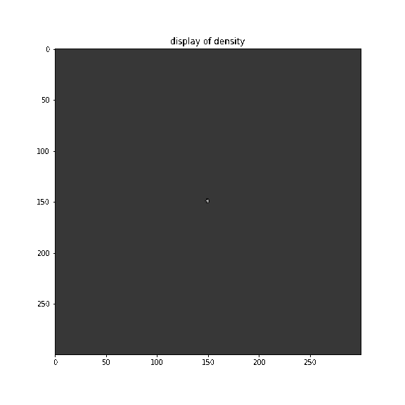
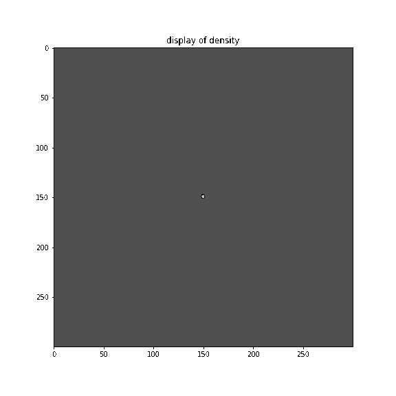
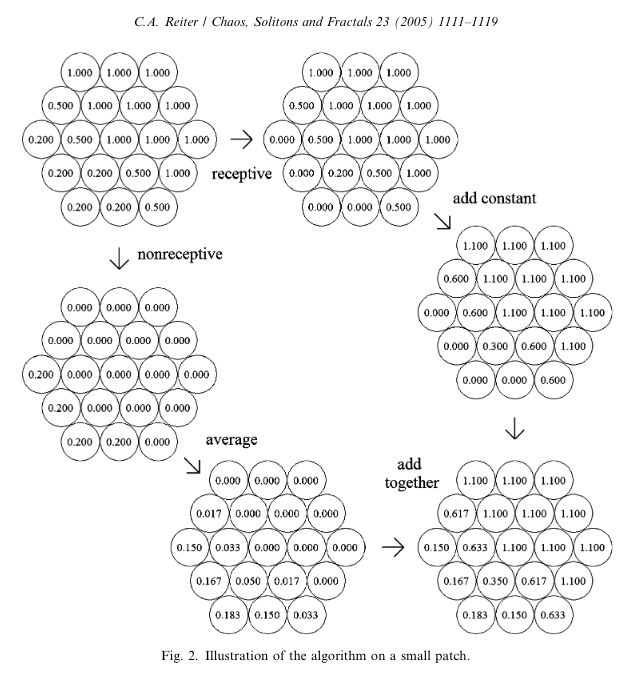

# Snowflake models
### Inspiration
John Conway, prof. Lin, nature and Cordelia, who loved nature more than anyone.

**Notes on Clifford A. Reiter's "A local cellular model for snow crystal growth"**
[link Reiter paper](https://patarnott.com/pdf/SnowCrystalGrowth.pdf)

- "physical studies have shown that the particular form of a snow crystal is dependend upon *temperature and saturation* in the growth environment." aka alpha and beta
- doesn't derive growth model from physical laws and nasty pdes, "our goal is to create a simple local model for snowflake growth that exhibits the variety of two-dimensional forms seen in snow crystals."
- the model is two dimensional and has only two parameters
- forms in snowflake: sector, stellar, dendrite and plate forms
- "very informally we view the value of any cell as measuring the amount of water at the cellular location. Values of one or higher are taken to correspond to ice, while lower values are taken to represent water in a form that may possibly move to neighboring cells."

### How does the model work?
**The Main Algorithm**

The automata can be described in two stages. Each stage may be computed by using a nearest neighbor hexagonal real-valued cellular automaton. In the lingo "the algorithm is a one-stage automaton on neighborhoods containing two levels.", In English: 'one stage' just means it makes only one computation for each cell at each timestep. 'containing two levels' means that the algorithm takes into account not only the adjacent cells but also those cells adjacent to the adjcacent cells.

The first stage is to determine the receptive sites. These are the sites that are ice or that have an immediate neighbor that is ice. 

The second stage, the values of the cells are given by the values at the receptive sites plus a constant plus a diffusion term. The diffusion term is a local average of a modified cellular field obtained by setting the receptive sites to zero. The receptive sites a viewed as permenantly storing any mass that arrives at that point, the mass in the unreceptive sites is free to move, and hence moves toward an average values.

*The constant gamma*

The constant $\gamma$ added to receptive sites informally captures the idea that some water may be available from outside the plane of growth. It captures the humidity of the environment.

*Background level*

The background level $\beta\in[0,1]$ is how humid the surrounding atmosphere is. We can eventually have this be dependent on the radius $r$ so that the conditions for growth are inhomogeneous.

*Avereaging*

The mass in the unreceptive sites is free to move, and hence moves toward an average value. It's a discrete diffusion equation (think heat equation / laplacian / probabilistic distributions of random walks). We could think of doing things like introducing drift to see what happens. 

Various weighted averages may be used on the unreceptive field. To start off I use the average of the current cell value with the average of it's nearest neighbors --> Thus, the center cell has wight 1/2 while the six neighboring cells each have weight 1/12.

*Diffusion*

The diffusion of vapor at the unreceptive sites at position $P$ and time $t$, denoted $u(t,P)$, is expected to satisfy the diffusion equation; it is correlated with temperature.
$$\frac{\partial u}{\partial t} = k\nabla^2 u$$
where $k$ is the diffusion constant and $\nabla^2 = \Delta = \delta d = d\star d$ is the laplacian. The Laplacian is approximated on the hexagonal lattice via
$$\nabla^2 u = \frac{2}{3}\bigg( -6 u(t,P) + \sum_{N\in nm(P)} u(t,N) \bigg)$$

Where $nm(P)$ are the 6 adjacent cells to $P$. So our discrete equation is 

$$u(t+1,P) = u(t,P) + \frac{\alpha}{12}\bigg( -6 u(t,P) + \sum_{N\in nm(P)} u(t,N) \bigg)$$

Here is a picture of the crucial equation because I don't think markdown renders inline latex

So $\alpha = 8 k$ is a scaled diffusion constant. 

Here is an illustration of how the algorithm works

**Initialization / Seed**
Snowflakes (and water dropplets I think too) form around a seed, which is usually a clump of non-water matter, like a mineral that was dragged up by evaoprating water into the clouds. 

The seed we are using is the simplest kind - a single cell of value 1, in a sea of constant background ($\beta$)

The boundary conditions are taken to be fixed at the background level at a fixed (euclidian distance from the initial cell). The purpose is to make the boundary conditions as isotropic as possible.

The algorithm is beautiful because it is an example of how very simply rules can give rise to complicated emergent properties.

### What is a cellular automata?
It's a grid of cells with some state and a some rules, it's descrete: you itteratively apply the rules on your grid, and update the state; a in our case our grid is hexagonal and the cells are hexagons with values.

Typically, the rule for updating the state of cells is the same for each cell and does not change over time (which is also discrete/ is counted in steps), and is applied to the whole grid simultaneously; you can think of it as like a discrete differential equation on a discrete space - when the rule for updating doesn't change over time this is like a time-independent diff-eq. The exceptions are stochastic cellular automata, where the rule is not deterministic but probabilistic, and asynchronous automata where the cells are updated one-by-one, instead of simultaneously.

Synonyms of cellular automata: cellular spaces, tesselation automata, homogeneous structures, cellular structures, tesselation structes, iterative arrays

